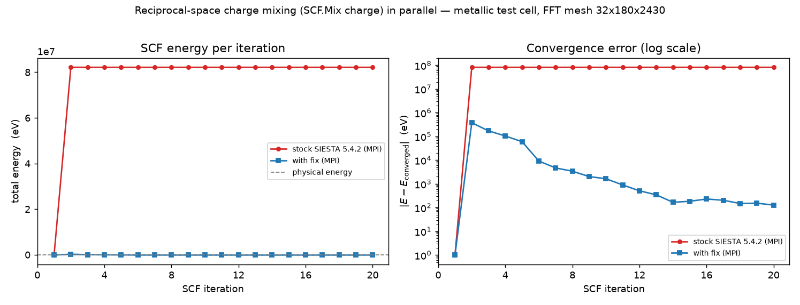

# Fix for SIESTA 5.4.2 — parallel charge-density mixing (`SCF.Mix charge`) is broken on large meshes

**TL;DR** — In SIESTA 5.4.2, reciprocal-space charge-density mixing (`SCF.Mix charge`, i.e. **Kerker / ρ(G) mixing**) **silently corrupts the density in parallel (MPI) runs on large meshes**: the SCF energy explodes to ~10⁸ eV within two iterations. The *same* calculation is **correct in serial**, and correct for small meshes. The cause is **not** the mixing scheme — it is SIESTA's distributed 3-D FFT (the pencil-transpose in module `m_fft`), which does not round-trip correctly for large/elongated meshes in parallel (the failure class of upstream GitLab issue [#170](https://gitlab.com/siesta-project/siesta/-/issues/170)).

This repo provides a **drop-in fix**: route the (cheap) charge-mixing FFT through a **gather → serial FFT → scatter** path. The serial FFT is bit-exact, so the parallel run reproduces the serial answer. The expensive part of the SCF loop (the diagonalization) stays fully parallel, and the FFT is a small fraction of an SCF step, so the overhead is negligible.



*Same calculation — Kerker charge mixing, 16 MPI ranks, FFT mesh 32×180×2430 — with stock SIESTA 5.4.2 vs. with this fix. **Left:** stock SIESTA's total energy explodes to +8.2×10⁷ eV at iteration 2 and stays pinned there; with the fix it remains physical and converges to the ground state. **Right:** the convergence error on a log scale — stock is stuck near 10⁸ eV (diverged), the fix decays smoothly toward convergence.*

---

## Who is affected

Anyone using `SCF.Mix charge` (reciprocal-space / Kerker charge mixing — the textbook cure for charge sloshing in large metallic cells) in an **MPI** SIESTA run whose **FFT mesh has a large dimension**. Serial runs and small meshes are unaffected, which makes this easy to miss: it works on your laptop test and explodes on the cluster.

The development system is a **graphene-on-chromium device cell** (210 atoms; FFT mesh **32 × 180 × 2430**, elongated along the transport direction), warm-started from a converged density matrix — but the bug is general to large meshes.

## Symptom

`SCF.Mix charge`, warm-started, in an MPI run on the large mesh:

```
scf: 1   -142776.6 eV
scf: 2  +82,178,078 eV     <-- explodes, then stays pinned (often ends in SIGSEGV)
```

The identical input in **serial** is fine, and **with this fix the parallel run reproduces it**:

```
scf: 1   -142776.6 eV
scf: 2     +235,969.9 eV   <-- a normal first-step Kerker overshoot
scf: 3      +28,873.8 eV
scf: 4      -38,160.8 eV   <-- recovering; converges normally
 ...
scf:20    -142,648.9 eV    <-- approaching the ground state
```

## Validation

Built with a foss-2023a-style toolchain (gfortran 13, OpenMPI, ScaLAPACK/ELPA). All runs warm-started from the converged DM; `MeshCutoff 400 Ry`.

| run | mesh | scf:2 energy | outcome |
|-----|------|--------------|---------|
| stock SIESTA, **serial** (1 rank)  | 32×180×2430 | +235,969.94 eV | converges (reference) |
| stock SIESTA, **parallel** (16 ranks) | 32×180×2430 | **+82,178,078 eV** | **diverges** |
| **with fix**, parallel (16 ranks)  | 32×180×2430 | **+235,969.91 eV** | **converges — matches serial to 5–6 sig figs** |
| with fix, parallel (16 ranks) | 32×180×720 (smaller cell) | — | converges to the same energy as the Pulay (density-matrix) baseline |

The decisive check: running the fixed code at 16 ranks reproduces the **exact serial trajectory** (e.g. scf:2 = +235,969.94 serial vs +235,969.91 at 16 ranks; residual difference is float32 grid / reduction-ordering noise). That proves the +235,969 overshoot is the genuine physical Kerker transient, not an FFT artifact.

## Root cause (short)

- The blow-up is **independent of the mixing scheme**: with DIIS on/off and Kerker damping on (q0²=1) or off (q0²=0), scf:2 is **bit-for-bit identical**. So the mixer is a bystander.
- It is the **FFT density reconstruction**. A round-trip test `FFT⁻¹(FFT(ρ)) − ρ` is ~10⁻¹⁴ (exact) in serial and for small meshes, but finite in parallel for the large mesh — and the error **grows with the number of MPI pencil splits**.
- It lives in the **shared parallel transpose** `redistributePencil`. A FFTW build does **not** help (FFTW only replaces the 1-D kernels; the transpose is called unconditionally in both paths). Setting `ProcessorY` (the workaround in #170) does not help for this mesh either.

Full reasoning and evidence: **[DIAGNOSIS.md](DIAGNOSIS.md)**.

## The fix

Because the **serial** 3-D FFT is bit-exact even for this mesh, the charge-mixing FFT is rerouted through it when running in parallel:

- **`Src/rhofft.F`** — when `Nodes > 1`, gather the mesh to one rank, run the exact serial 3-D FFT there, and scatter back, instead of the buggy distributed `fft`. The local layout is kept identical to what `order_rhog` already indexes, so no other file changes. (`Nodes == 1` keeps the original, correct serial path.)
- **`Src/fft.F`** — adds `fft_serial_global`, a serial 3-D complex FFT over a global array (reuses the existing `gpfa` 1-D routine and trig tables). Also fixes two genuine `gpfa` slice typos (`f(IOffSet+1:n)` → `:2*n`).
- **`Src/m_fft_gpfa.F`** — reverts the `gpfa` array dummies from assumed-shape `A(:)` to assumed-size `A(*)` (the strided index arithmetic assumes assumed-size).

`Src/m_rhog.F90` and `Src/dhscf.F` are **unchanged**.

## How to apply

```bash
# from the root of a pristine SIESTA 5.4.2 source tree
patch -p1 < patches/rhofft.F.patch
patch -p1 < patches/fft.F.patch
patch -p1 < patches/m_fft_gpfa.F.patch
# then rebuild as usual
```
or simply copy the three files from `src/` over `Src/`.

## Reproducing / testing

See **[tests/README.md](tests/README.md)** — an `fdf` with `SCF.Mix charge` + Kerker, and how to run the same input at `-np 1` and `-np 16` and compare. Before the fix the parallel run explodes at scf:2; after the fix it matches serial.

## Scope

Tested for spin-unpolarized (`nspin = 1`) diagonalization runs. This is a **workaround at the application layer** — it sidesteps the distributed-FFT bug rather than fixing the transpose itself (that is upstream's to fix). It makes `SCF.Mix charge` usable in parallel today.

## References

- SIESTA GitLab **#170** — parallel FFT grid-distribution bug: https://gitlab.com/siesta-project/siesta/-/issues/170
- SIESTA GitLab **#169** — Y/Z process-grid ordering: https://gitlab.com/siesta-project/siesta/-/issues/169
- SIESTA GitLab **MR !115** — FFT distribution rework + FFTW for Poisson
- SIESTA GitLab **#82** — `SCF.RhoG.DIIS.UseSVD` (a separate, already-known charge-mixing bug; use `SCF.RhoG.DIIS.UseSVD False`)

## License

The patched SIESTA source files are GPL (© the SIESTA group), like SIESTA itself. The patches, docs, and test scripts here are released under the same terms.
